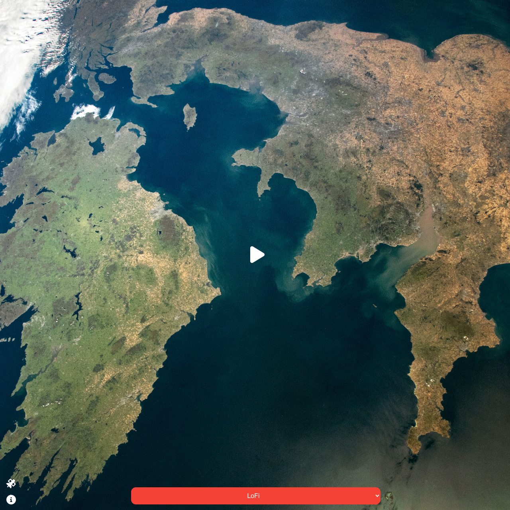

# Live ISS and Music Streaming

This project provides a simple interface for watching live views from the International Space Station (ISS) while listening to relaxing LoFi or other music streams. It is designed to be a calming experience, with a combination of atmospheric sounds and visuals from the ISS.

## Features
- **Live ISS Feed**: Streams live video from the ISS, providing a view of Earth from space.
- **Music Player**: Select from a variety of music streams, including LoFi, Jazz, Classical, and more, to accompany the ISS feed.
- **Play/Pause Controls**: Users can play or pause the music and video streams as needed.
- **ISS Tracker Map**: Includes a button to display a live tracking map of the ISS's position.
- **Information Modal**: Provides additional details about the project with an easy-to-access info button.

## Files
- **index.html**: Contains the structure for the main webpage, including all interactive elements such as the ISS video, music player, and buttons for information and ISS tracking.
- **style.css**: Styles the layout and all elements on the page, including the ISS video container, music controls, and buttons to ensure a cohesive and visually appealing interface.
- **index.js**: Implements the logic for controlling the YouTube video, managing the music playback, toggling the ISS tracker, and handling button interactions.

## Technologies Used
- **HTML5**: Provides the structure for the website, including video and audio elements.
- **CSS3**: Styles the interface to ensure an aesthetically pleasing user experience, with specific classes for buttons, modals, and the video container.
- **JavaScript (with jQuery)**: Implements the interactive functionality, such as play/pause buttons, ISS tracking toggle, and modal display.
- **YouTube IFrame API**: Used to embed and control the live video feed from the ISS.

## How to Run
1. Clone the repository:
   ```bash
   git clone <repository-url>
   ```
2. Open the `index.html` file in your browser to start viewing the live ISS feed and listening to your selected music stream.

## Future Improvements
- **Add More Music Options**: Expand the music selection to include more genres or allow users to add their own URLs.
- **Improve Mobile Support**: Enhance the layout and controls to improve the experience on smaller devices.
- **Volume Control**: Add sliders for individual volume control of the YouTube video and music streams.
- **Persistent Settings**: Save user preferences, such as the last selected music stream and volume level.

## Screenshot


## License
This project is open-source and available under the MIT License.